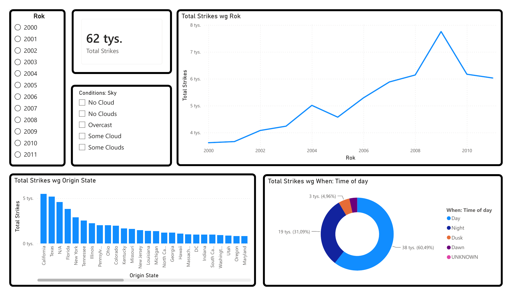
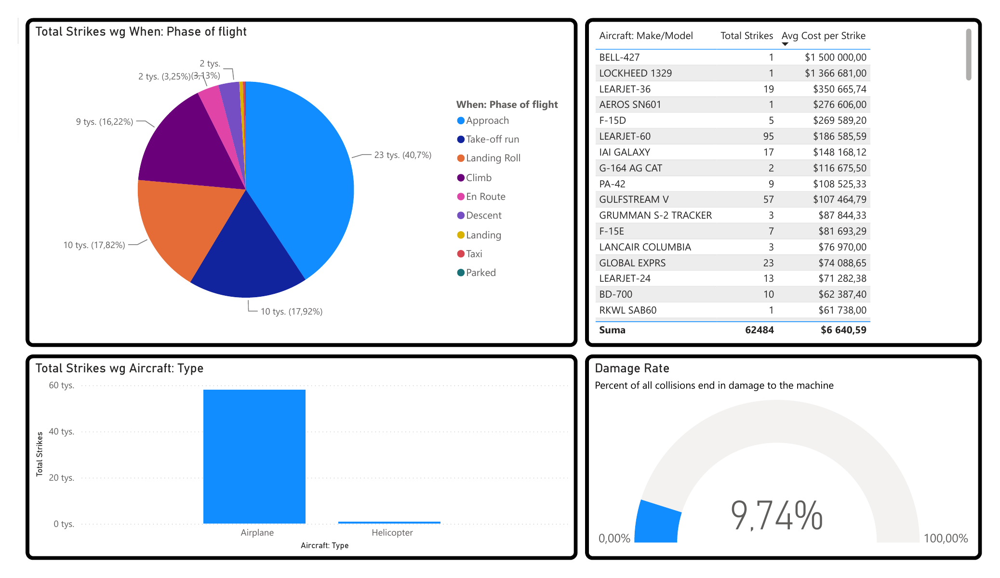
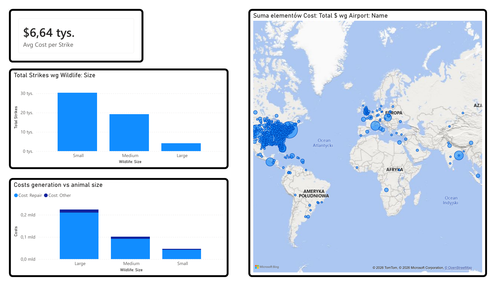
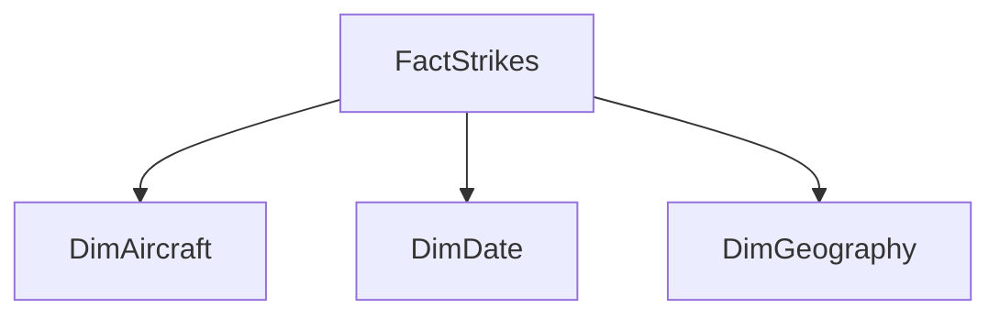

# Bird Strikes Analytics - Power BI

Power BI portfolio project analysing historical bird and wildlife strikes involving aircraft. The report combines data preparation, dimensional modelling, DAX measures and interactive visualisation to examine operational patterns, damage risk and financial impact.

Developed in 2026 as an academic project during the MSc in Informatics and Econometrics at AGH University of Krakow. I independently completed the full analytical workflow: data preparation, model design, measures and dashboard development.



## Project objective

The analysis answers five practical questions:

- How did the number of reported strikes change between 2000 and 2011?
- During which flight phases and times of day did strikes occur most often?
- Which states, airports and aircraft types were most exposed?
- How frequently did a strike cause aircraft damage?
- How did wildlife size relate to repair and other costs?

## Key results

| Metric | Dashboard result |
| --- | ---: |
| Analysed strike records | 62,484 |
| Damage rate | 9.74% |
| Average cost per strike | $6,640.59 |
| Strikes during approach | 40.70% |
| Daytime strikes | 60.49% |
| Night-time strikes | 31.09% |

Additional observations:

- Reported strike volume generally increased over the analysed period and peaked in 2009.
- Approach, take-off run, landing roll and climb accounted for most reported events.
- Large wildlife produced fewer events than small wildlife but generated the highest aggregate cost.
- California and Texas were the leading states by strike count in the dashboard dataset.

## Dashboard pages

### 1. Operational overview

Time trend, state distribution, time-of-day structure and interactive filters.


### 2. Risk analysis

Flight-phase exposure, aircraft type and model comparison, average cost and damage rate.



### 3. Cost analysis

Wildlife-size comparison, repair versus other costs and airport-level geographic distribution.



## Data model

The report uses a star schema with one fact table and three dimensions.



| Table | Purpose |
| --- | --- |
| `FactStrikes` | Strike events, damage indicators, flight context and cost values |
| `DimAircraft` | Aircraft type and make/model attributes |
| `DimDate` | Date and year used for time analysis |
| `DimGeography` | Airport and state attributes used for geographic analysis |

Key measures include `Total Strikes`, `Damage Rate` and `Avg Cost per Strike`. More detail is available in [`docs/data-model.md`](docs/data-model.md).

## Data scope

- Raw source: 99,404 rows and 37 columns.
- Period: 1 January 2000 to 31 December 2011.
- Dashboard scope: 62,484 records with a populated `When: Time of day` value.
- Main subject areas: aircraft, flight phase, wildlife, weather, location, damage and cost.

The workbook is a historical snapshot based on the [FAA National Wildlife Strike Database](https://www.faa.gov/airports/airport_safety/wildlife). It should not be treated as a current aviation-safety assessment.

## Technology and skills

- Power BI Desktop
- Power Query
- DAX
- dimensional modelling and star schema design
- data-quality assessment
- KPI definition
- dashboard and interaction design
- analytical storytelling

## Repository structure

```text
.
|-- assets/                         Dashboard images
|-- dashboard/
|   |-- Bird-Strikes-Analytics.pbix
|   `-- Bird-Strikes-Analytics-Report.pdf
|-- data/
|   `-- Bird-Strikes-Source-Data.xlsx
|-- docs/
|   |-- data-model.md
|   `-- data-quality.md
`-- README.md
```

## Open the project

1. Download [`dashboard/Bird-Strikes-Analytics.pbix`](dashboard/Bird-Strikes-Analytics.pbix).
2. Open it in Power BI Desktop.
3. If Power BI requests a new source path, point the query to [`data/Bird-Strikes-Source-Data.xlsx`](data/Bird-Strikes-Source-Data.xlsx).
4. Use the year and sky-condition slicers to explore the report.

The exported three-page PDF is available at [`dashboard/Bird-Strikes-Analytics-Report.pdf`](dashboard/Bird-Strikes-Analytics-Report.pdf).

## Limitations and next improvements

- The raw data contains missing values and inconsistent labels such as `No Cloud` and `No Clouds`.
- `N/A` is a frequent geographic category and should not be interpreted as a state.
- Cost values contain strong outliers; average cost should be interpreted together with event counts.
- Wildlife-strike reporting is observational and may be incomplete.
- A future version should standardise categories, add median cost, show missing-data rates and include severity segmentation.
