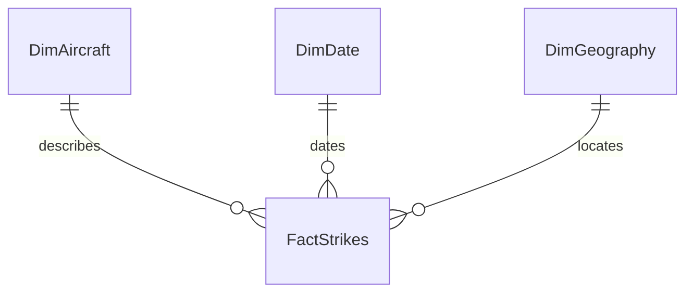

# Data model

## Model design

The Power BI model follows a star-schema structure. `FactStrikes` stores event-level observations and connects to three descriptive dimensions.

| Table | Representative fields | Analytical role |
| --- | --- | --- |
| `FactStrikes` | strike record, phase of flight, time of day, wildlife size, damage flag, repair cost, other cost, total cost | Measures and event-level filtering |
| `DimAircraft` | aircraft type, aircraft make/model | Aircraft comparison and drill-down |
| `DimDate` | date, year | Trend analysis and year filtering |
| `DimGeography` | airport name, origin state | Geographic comparison and mapping |

## Core measures

| Measure | Business meaning |
| --- | --- |
| `Total Strikes` | Number of strike records in the current filter context |
| `Damage Rate` | Share of analysed strikes marked as causing aircraft damage |
| `Avg Cost per Strike` | Total reported strike cost divided by the number of analysed strikes |
| Repair cost | Aggregate inflation-adjusted repair cost |
| Other cost | Aggregate inflation-adjusted non-repair cost |

The measures respond to report filters such as year, weather conditions, aircraft attributes, location, flight phase and wildlife size.

## Report pages

1. **Operational overview** - volume, trend, geography and time of day.
2. **Risk analysis** - flight phase, aircraft exposure, damage and average cost.
3. **Cost analysis** - wildlife size, cost structure and airport map.
